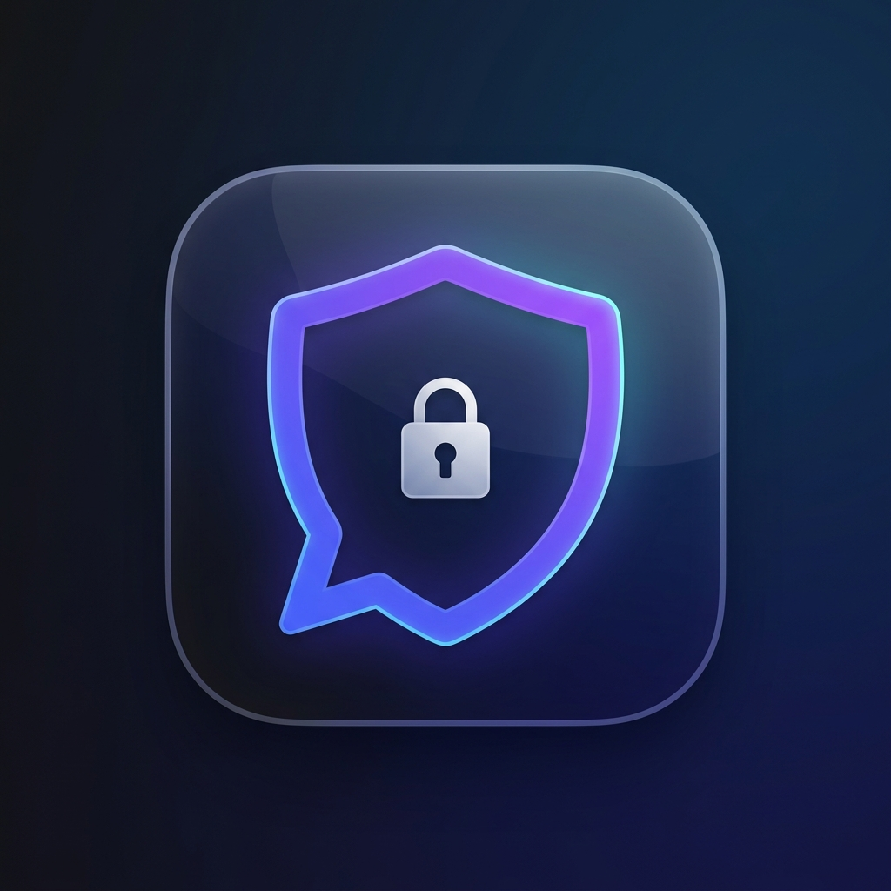

<div align="center">



# Chatly

**The secure, private, end-to-end encrypted messenger built for the real world.**

[](https://flutter.dev)
[](https://nodejs.org)
[](https://www.typescriptlang.org)
[](https://python.org)
[](LICENSE)
[](CONTRIBUTING.md)

*If you find Chatly useful, please consider giving it a ⭐ on GitHub — it helps others discover the project.*

[Features](#features) · [Architecture](#architecture) · [Quick Start](#quick-start) · [Deployment](#deployment) · [Roadmap](docs/ROADMAP.md) · [Security](docs/SECURITY.md)

</div>

---

## What is Chatly?

Chatly is a **privacy-first messaging platform** that combines a Flutter cross-platform client with a stateless Fastify relay.

Unlike conventional messaging apps that store message history on centralized servers, Chatly operates on a **zero-trace relay model**: messages are processed entirely in-memory and scrubbed the moment they are delivered. No message logs. No metadata retention. No surveillance surface.

---

## Features

### Security & Privacy
- **Signal Protocol E2EE (1-to-1)** — Full Double Ratchet (X3DH-Lite + HKDF + AES-256-GCM). Identity keys are generated on-device with Ed25519 signing and X25519 DH. The server only ever sees opaque ciphertext.
- **True Group E2EE** — Each group has a random AES-256 symmetric key. That key is distributed to members using ECIES (ephemeral X25519 + HKDF + AES-256-GCM key wrapping), so every member holds their own individually-encrypted copy. The server stores blobs it cannot read.
- **Zero-Trace Relay Pipeline** — The backend holds messages transiently in RAM (or Redis with a 24-hour TTL if the recipient is offline) and deletes them immediately upon delivery.
- **Email Verification & 2-Step Verification** — Every account goes through an email OTP gate. Optional TOTP-based second factor is available from the Security settings.
- **Disposable Email Blocking** — Server-side blocklist prevents sign-ups from known temporary mail providers.
- **Dead Man's Switch** — Configurable auto-wipe of all local data after a period of inactivity (default: 30 days).
- **Forensic Eraser** — Multi-pass overwrite of deleted messages to prevent recovery by forensic tools.
- **Key Fingerprints / Safety Numbers** — 60-digit commutative SHA-256 fingerprint for out-of-band identity verification.

### Messaging
- **1-to-1 Encrypted Chats** — Full Double Ratchet session with forward secrecy and break-in recovery. Read receipts and typing indicators included.
- **Encrypted Group Chats** — Real AES-256-GCM group encryption. Includes **Campfire Groups** — ephemeral groups that auto-dissolve after a configurable timer.
- **Ephemeral Timers** — Per-message configurable self-destruct timers.
- **Offline Queue** — Messages are queued in Redis (or in-memory) and delivered when the recipient reconnects.

### Personalization
- **15+ Themes** — Obsidian, Dracula, Cyberpunk, Deep Ocean, Emerald, and more.
- **Chat Wallpapers** — 5+ premium wallpapers built in.
- **Custom Fonts** — 5 curated typeface options.
- **Smart Moods** — Custom status markers.

---

## Architecture

```
chatly/
├── apps/
│   └── mobile/                   # Flutter client (Android · iOS · Web · Windows · macOS · Linux)
│       ├── assets/               # App icon, wallpapers, Lottie animations
│       └── lib/
│           ├── core/             # Shared widgets, theme tokens, AppConfig
│           ├── features/         # Screen-level feature modules (auth, chat, groups, pulse, settings)
│           ├── navigation/       # Bottom nav shell with adaptive desktop layout
│           ├── providers/        # Riverpod global state (theme, connection, layout, wallpaper)
│           └── services/         # Business logic (auth, websocket, E2E crypto, push, P2P)
│
├── packages/
│   ├── chatly-server/            # Fastify backend (Node.js + TypeScript)
│   │   └── src/
│   │       ├── db/               # PostgreSQL schema init + in-memory fallback
│   │       ├── routes/           # REST endpoints: /api/auth/*
│   │       ├── services/         # Email (Nodemailer + Ethereal), push tokens
│   │       └── sockets/          # WebSocket connection handler & message routing
│   │
│   └── chatly-ml/                # Python FastAPI ML microservice
│       ├── app.py                # FastAPI server + endpoint definitions
│       └── requirements.txt      # detoxify, torch, fastapi, uvicorn
│
├── docs/
│   ├── ARCHITECTURE.md           # Detailed technical architecture breakdown
│   ├── SECURITY.md               # Cryptographic flows and threat model
│   ├── DEVELOPMENT.md            # Local development setup
│   ├── HOSTING.md                # Production hosting guide (Railway, Supabase, Upstash)
│   ├── DEPLOYMENT.md             # APK / EXE / Web build instructions
│   └── ROADMAP.md                # Upcoming feature milestones
│
└── README.md
```

### Key Technical Decisions

| Decision | Rationale |
|---|---|
| **Fastify over Express** | 3× higher throughput, built-in schema validation, TypeScript-first |
| **Riverpod over Provider/Bloc** | Compile-safe, no BuildContext dependency, testable |
| **Hive over SQLite** | Pure Dart, encrypted boxes, no JNI overhead on Android |
| **X25519 + AES-256-GCM** | Best-in-class key agreement + authenticated encryption |
| **In-memory relay** | Zero-trace model: no message hits disk on the relay server |

---

## Quick Start

### Prerequisites
- [Node.js](https://nodejs.org) v18 or newer
- [Flutter SDK](https://flutter.dev/docs/get-started/install) 3.x

### 1. Clone the Repository
```bash
git clone https://github.com/Saff9/chatlypro.git
cd chatlypro
```

### 2. Start the Backend
```bash
cd packages/chatly-server
npm install
npm run dev
# Fastify starts on http://localhost:5000
# No database config needed — boots with in-memory fallback automatically.
```

### 3. Run the Flutter Client
```bash
cd apps/mobile
flutter pub get
flutter run -d chrome          # Web browser
flutter run -d windows         # Windows desktop
flutter run                    # Connected Android/iOS device
```

---

## Deployment

### Quick Deploy to Railway

[](https://railway.app)

### Quick Deploy to Render

[](https://render.com/deploy?repo=https://github.com/Saff9/chatlypro.git)

See the full step‑by‑step guide in [docs/HOSTING.md](docs/HOSTING.md).

### Build Release APK
```bash
cd apps/mobile
flutter build apk --release \
  --dart-define=BASE_URL=https://your-api-domain.com/api \
  --dart-define=WS_URL=wss://your-api-domain.com
```

### Build Windows EXE
```bash
cd apps/mobile
flutter build windows --release \
  --dart-define=BASE_URL=https://your-api-domain.com/api
```

See [docs/DEPLOYMENT.md](docs/DEPLOYMENT.md) for full platform-specific instructions.

---

## Environment Variables

| Variable | Required | Description |
|---|---|---|
| `DATABASE_URL` | No | PostgreSQL connection string. Falls back to in-memory store. |
| `REDIS_URL` | No | Upstash/Redis connection URL. Falls back to in-memory Map. |
| `JWT_SECRET` | **Yes (prod)** | Minimum 32-character random string for signing auth tokens. |
| `ALLOWED_ORIGINS` | No | Comma-separated CORS origin whitelist. Defaults to `*` in dev. |
| `PORT` | No | Server port. Defaults to `5000`. |
| `NODE_ENV` | No | `development` or `production`. Enables production-only checks. |

---

## Changelog

### Code Quality & Architecture Refactor (latest)

**Removed — dead code**
- `calculator_screen.dart` deleted — leftover from the Calculator disguise feature removed in a prior release. No longer referenced anywhere.

**Refactored — `chat_screen.dart` split**
- `chat_screen.dart` was 2 582 lines mixing state, layout, and widget rendering. Split into focused files:
  - `widgets/message_bubble.dart` — `ChatMessageBubble`, `ReactionPill`, and `kReactions` constant. Pure rendering, no state dependency.
  - `widgets/chat_input_bar.dart` — `ChatInputBar` and `RecordingWaveform`. All interaction callbacks injected by the parent.
  - `widgets/chat_painters.dart` — `ChatWallpaperPainter` and `MockQrCodePainter`.
- `chat_screen.dart` now focuses on: state management, Double Ratchet session lifecycle, WebSocket event handling, and the Scaffold/build tree. Down to ~1 988 lines.
- `ReactionPill.onTap` now reloads messages from storage directly instead of requiring a full rebuild path through `_buildReactionPill`.

---

### Send Logic & Bug Fixes

**Fixed — critical**
- **Offline message delivery was silently broken.** `deliverOfflineMessages` wrapped the stored payload under a `data:` key (`{ type, data: { senderId, ciphertext } }`), but the Flutter client read `payload['senderId']` and `payload['ciphertext']` at the top level. Every message sent while the recipient was offline was dropped on delivery. Fixed by spreading the stored object at the top level; the `groupId` field now also determines the event type (`message` vs `group_message`).
- **Group messages not queued for offline members.** 1-to-1 messages were queued in Redis for offline recipients; group messages were not. Offline group members would miss messages until a full history re-fetch. Group messages are now queued under the same `msg:{username}:{uuid}` Redis key scheme and delivered on reconnect.

**Improved — send reliability**
- **`sent_ack` WebSocket event.** The server now sends a `{ type: 'sent_ack', clientId, recipientId, timestamp }` response to the sender after relaying (or queuing) a message. The Flutter client matches the ack to the optimistic message by `clientId` and flips `isSent = true` — eliminating the race condition where `isSent` was mutated before the server confirmed receipt.
- **`isSent` is now server-confirmed.** Previously `isSent` was set to `true` immediately after `sink.add()` regardless of whether the server received it. Now it flips only when the `sent_ack` arrives. Offline/outbox messages stay in the pending (clock) state until the outbox is flushed and acknowledged.

**Fixed — typing indicator**
- Typing indicator no longer freezes when the remote user crashes or loses network. A 6-second auto-clear timer fires if no follow-up `isTyping` event arrives, matching the behaviour of Signal and WhatsApp.
- Typing throttle is now **per-recipient** (`Map<String, DateTime>`). Previously one global timestamp caused chatting with two contacts to suppress typing indicators for both after the first send.
- `_typingClearTimer` and `_recordingTimer` are now cancelled in `dispose()` to prevent setState-after-dispose crashes.

**Improved — outbox flush**
- The outbox flush now inserts a **550 ms gap between messages** (≈ 109 msg/min), safely under the server's 120 msg/min hard limit. Previously a user with 100+ queued messages would be disconnected immediately on reconnect.

**Removed — dead code**
- `shake_service.dart`, `wrapped_service.dart`, `p2p_mesh_service.dart`, `p2p_chat_screen.dart` deleted. These files had zero imports in the live codebase.

**Added — documentation**
- `CLAUDE.md` — project context file for Claude Code: layout, key invariants, common pitfalls, service responsibilities.
- `CONTRIBUTING.md` — updated with setup guide, code style rules, security invariants, PR checklist, commit format, and list of changes that will not be merged.

---

### Friend Requests & UI/UX Overhaul

**Added**
- **"Add Contact" bottom sheet** — tapping the new FAB opens a modal sheet with a live username search, user bio preview, and a "Send Request" button. A "Scan QR" shortcut at the bottom handles QR-based pairing without requiring camera permission upfront.
- **Modern connection request cards** — pending incoming requests now render as individual gradient cards (indigo → dark) with a glowing accept button (green gradient) and an icon-only decline button. A pill badge shows the live request count.
- **Floating snackbars** — all connection-related feedback (sent, accepted, not found) now uses floating snackbars with rounded corners for a consistent feel.

**Removed**
- **UDP proximity / P2P mesh invite code** — `RawDatagramSocket`, `_startProximityListener`, `_handleIncomingUdpInvite`, `_broadcastProximityInvite`, `simulateProximityRequest`, and `clearProximityRequest` removed from `connection_provider.dart`. Also removed `dart:io` import.
- **`isProximity` field** on `ConnectionInvite` — dead field removed; persisted JSON is backward-compatible (field ignored on load).
- **`activeProximityRequest`** on `ConnectionState` — removed along with the `clearProximity` `copyWith` parameter.

**Fixed**
- `acceptInvitation` now removes the invite from the list rather than changing its status to `'accepted'`. Accepted users are immediately visible in the chat list.
- `rejectInvitation` now removes the invite from the list rather than changing its status to `'rejected'`. Rejected invites no longer accumulate in memory/Hive.
- `syncPendingInvitations` skips usernames already in `connections`, preventing ghost requests from re-appearing after acceptance.
- `connection_accepted` WebSocket event now removes the outgoing invite instead of leaving it in the list with status `'accepted'`.

---

### Production Hardening

**Added**
- Real group E2EE via ECIES key distribution. Each group gets a random AES-256 key. When the creator makes a group or invites a member, the key is wrapped (ephemeral X25519 + HKDF-SHA256 + AES-256-GCM) under the recipient's DH identity public key and stored server-side. Members unwrap it locally with their private key — the server never sees the plaintext group key.
- `group_keys` DB table: `(group_id, user_id, encrypted_key)` — stores ECIES-wrapped group keys, one per member.
- `POST /api/groups/:id/keys` — distribute a wrapped group key to a member (any existing member may call this).
- `GET /api/groups/:id/keys/my` — fetch my wrapped group key (membership verified server-side).
- `EncryptionService.wrapGroupKey()` and `unwrapGroupKey()` — ECIES primitives in the Flutter client.
- `ApiService.distributeGroupKey()` and `fetchGroupKey()` — client-side API wrappers.

**Removed**
- **Lucky Pulse** — anonymous broadcast feed removed from navigation and server routes.
- **Calculator disguise** — removed from main navigation and shake trigger.
- **Shake-to-panic** — `ShakeService` removed from main navigation.
- **P2P Mesh tab** — removed from default navigation.
- **Python ML microservice** — `chatly-ml` was already a stub; removed from docs.
- **`wrapped_service.dart`** — stub file, removed from the active codebase.

**Fixed**
- Group encryption was previously broken: each device generated its own random local key, so members could not decrypt each other's messages. Fixed by the ECIES key distribution flow above.
- `layout_provider.dart` default tab order updated to `[chats, groups, settings]`; legacy `pulse` entries are filtered out on load.

## Roadmap

See [docs/ROADMAP.md](docs/ROADMAP.md) for the full list of planned features.

---

## Contributing

Contributions are welcome and appreciated. Please read [CONTRIBUTING.md](CONTRIBUTING.md) before opening a pull request. All contributions must pass `flutter analyze` and the server TypeScript build without warnings.

---

## Security

Found a vulnerability? Please **do not open a public issue**. Instead, email the maintainers directly (contact details in the Security policy). See [docs/SECURITY.md](docs/SECURITY.md) for the full threat model and disclosure process.

---

## License

Chatly is released under the [MIT License](LICENSE). You are free to use, modify, and distribute this software — attribution is appreciated but not required.
