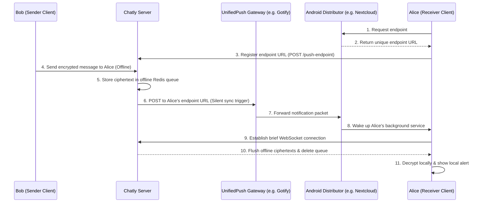

# Chatly Security & Cryptography Specification 🔒

Chatly is built from the ground up to prevent data breaches, surveillance, and hacks. The system operates on a zero-trust model: even if the Chatly database and WebSocket relay are fully compromised, attackers only obtain encrypted ciphertexts they cannot decode.

---

## 1. End-to-End Encryption (E2E) Flow

Chatly adapts the Signal Protocol (Extended Triple Diffie-Hellman (X3DH) and the Double Ratchet Algorithm) for secure channel setup:

```
[Alice]                                [Server]                                 [Bob]
   │                                      │                                       │
   │ 1. Request Bob's Public Keys ───────>│                                       │
   │ <────── Return Bob's Pre-key Bundle │                                       │
   │                                      │                                       │
   │ 2. Perform X3DH DH Handshake         │                                       │
   │    Compute Shared Master Secret      │                                       │
   │                                      │                                       │
   │ 3. Encrypt: Ciphertext = AES-GCM(msg)│                                       │
   │                                      │                                       │
   │ 4. Send Ciphertext + DH header ─────>│                                       │
   │                                      │ 5. Relay in-memory (No logging) ────> │
   │                                      │                                       │ 6. Receive & decrypt
   │                                      │                                       │    Double Ratchet rolls key
```

### Protocol Details:
- **Key Ratcheting**: Every message is encrypted with a unique key generated using KDF (Key Derivation Function) chains. Keys roll forward with every send/receive round-trip. Old keys are destroyed instantly to maintain **Forward Secrecy** (if a future key is leaked, past chats remain safe).
- **Asymmetric Handshake**: Done via X25519 Elliptic Curve keys.
- **Symmetric Encryption**: Handled using authenticated AES-GCM (256-bit) to guarantee message integrity.

---

## 2. Zero-Trace Architecture (Data Breach Prevention)

Most messenger breaches happen because servers store chat history. Chatly solves this by storing **nothing**:

| Data Type | Server Storage Policy | Expiry / TTL |
|-----------|-----------------------|--------------|
| **Delivered Message** | Never written to disk. Deleted from memory immediately after socket push. | Instantly |
| **Undelivered Message** | Stored in Redis (encrypted ciphertext only, server cannot read). | 24 Hours (Hard delete) |
| **User Presence** | Active in-memory flag. | 30 Seconds |
| **Typing State** | In-memory relay packet. | 3 Seconds |

- **No Backups on Cloud**: Chatly has no cloud databases for message logs. Chat backups are local-only (exported manually by premium users to `.txt` files on their own device storage).

---

## 3. Privacy-Preserving Username & Contact Matching

To ensure users can connect without exposing sensitive details:
- **No Email Exposure**: Emails are hashed with bcrypt before indexing. When logging in, the server hashes your input and matches it against the database. The database does not contain a list of readable emails.
- **Hashed Contact Matching**: When searching contacts, the client hashes phone numbers locally (using SHA-256) and sends the hashes to the server. The server compares them against registered user phone hashes. The raw numbers are never sent, logged, or saved.
- **Direct QR Connect**: Users can connect instantly offline by scanning a QR containing public cryptographic keys and username headers, removing search logs.

---

## 4. Vault Chats (Self-Destructing Mode)

Vault mode adds an extra layer of on-device ephemeral security:
- **Zero Local Footprint**: Vault messages are cached strictly in temporary RAM. The moment the user exits the chat window, the memory is cleared. They are never written to the Hive database.
- **Screenshot Protection**: Android applications run with `FLAG_SECURE` layout flags inside Vault Chat, blocking screenshots and screen recorders. iOS hides screen previews when the app enters the background.

---

## 5. Local Device Security: Dead Man's Switch & Camouflage

To protect against physical device seizures, phone loss, or unauthorized local access:
- **Dead Man's Switch**: On app startup and during background/resume cycles, Chatly tracks active usage. If the app is inactive for a user-defined threshold (defaulting to 30 days), it triggers an automated local database shredding operation.
  - **Shred Scope**: Wipes the Hive settings box, secure key pairs (X25519), shared secrets, session JSON web tokens, and pending offline outboxes. This data deletion is permanent and cannot be recovered by the server.
  - **Wipe Protection**: Accidental manual triggers are prevented via double-confirmation panels requiring the exact uppercase input of `SHRED DATA`.
- **App Decoys & Disguises**: Users can disguise Chatly behind fully functional mock apps:
  - **Calculator**: Operates as a math calculator. Unlocks when dialing passcode `5555`.
  - **Weather**: Operates as a weather forecast dashboard. Unlocks by tapping the temperature display 3 times.
  - **Notepad**: Operates as a personal notepad. Unlocks when saving a note containing the title or content "unlock".

---

## 6. P2P Proximity Mesh & Metadata Shielding

For scenarios where external networks are unavailable, censored, or heavily monitored:
- **Local Network Relays**: Chatly initiates direct offline messaging using raw UDP/TCP connections over local networks (Wi-Fi, Ethernet, or Ad-Hoc networks) on ports `4545`/`4546`.
- **Zero Centralized Metadata**: Direct socket routing generates zero external connection logs, preventing third parties from logging metadata (who chatted with whom, at what time, or from where).

---

## 7. Zero-Trace Push Notifications & UnifiedPush Roadmap

To balance real-time responsiveness with absolute metadata privacy, Chatly implements a decoupled push architecture:

### 7.1 Zero-Trace Push (FCM implementation)
- **Data-Only Triggers**: Push notifications routed through Google's Firebase Cloud Messaging (FCM) or Apple's Push Notification service (APNs) never carry plaintext messages, sender IDs, or key negotiation headers.
- **Silent Synchronization**: The push contains a data payload of type `sync` with a random message ID. Upon receipt, the mobile application wakes up silently in the background, establishes a secure WebSocket connection to the Chatly relay server, downloads the pending encrypted messages, decrypts them locally, and raises a local user notification.

### 7.2 Decentralized Alternative: UnifiedPush Roadmap
For de-Googled Android installations (e.g., GrapheneOS, LineageOS), Chatly plans to support **UnifiedPush** to bypass centralized Firebase servers entirely.




